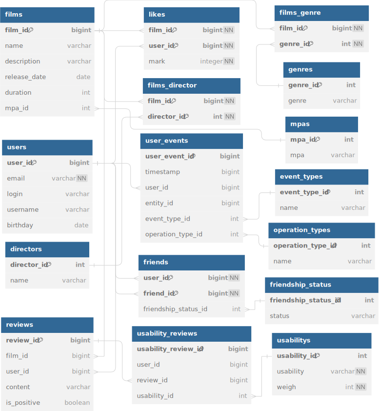

# java-filmorate
**Filmorate project** - Educational project to create a service for rating films.

## Database structure


The database contains information about films (**table films**) and users (**table users**).
Each film can have several genres (**table genre**), rating of the Motion Picture Association (abbreviated as MPA). This rating determines the age limit for the film. The user can like each movie (**likes table**).

A user can send a friend request to another user. Status for a “friendship” (**table friendship_status**) connection between two users:
* unconfirmed - when one user sent a request to add another user as a friend,
* confirmed - when the second user agreed to be added.

### Examples of SQL queries

Films genre:
```SQL
SELECT 
	f."name",
	g."genre"
FROM "films" AS f
LEFT JOIN "films_genre" AS fg ON fg."film_id" = f."film_id"
LEFT JOIN "genres" AS g ON fg."genre_id" = g."genre_id";
```

Top list of best films:
```SQL
SELECT 
	f."name" AS name,
	COUNT(l."film_id") AS count
FROM "films" AS f
LEFT JOIN "likes" AS l ON l."film_id" = f."film_id"
GROUP BY name
ORDER BY count DESC;
```

Number of user friends:
```SQL
SELECT 
	u."username" AS name,
	COUNT(f."friend_id") AS count
FROM "users" AS u
LEFT JOIN "friends" AS f ON f."user_id" = u."user_id"
GROUP BY name
ORDER BY count DESC;
```

Common friends of users:
```SQL
SELECT *
FROM "users" AS u
WHERE u."user_id" IN (
    SELECT friends_of_first.friend
    FROM (
        SELECT "friend_id" AS friend FROM "friends" WHERE "user_id" = 1
        UNION
        SELECT "user_id" AS friend FROM "friends" WHERE "friend_id" = 1
        ) AS friends_of_first
    JOIN (
        SELECT "friend_id" AS friend FROM "friends" WHERE "user_id" = 2
        UNION
        SELECT "user_id" AS friend FROM "friends" WHERE "friend_id" = 2
        ) AS friends_of_second
    ON friends_of_first.friend = friends_of_second.friend
);
```